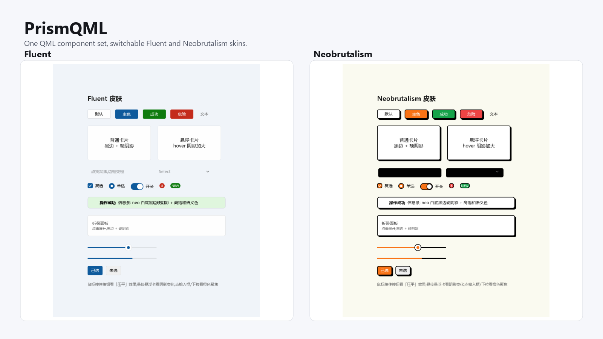

# PrismQML

> **One QML component set, multiple design languages — switchable at runtime.**

PrismQML is a **multi-skin UI engine** built on PySide6 + QML. The same
components switch live between **Fluent**, **Neobrutalism**, **Vintage Ticket**,
and **Neumorphism**, independently of the light/dark theme.



```python
from prismqml import setSkin, Skin

setSkin(Skin.NEOBRUTALISM)   # switch the whole app's design language in one line
```

## Why PrismQML

- **🎨 Multi-skin engine** — `setSkin()` switches between Fluent / Neobrutalism / Vintage Ticket / Neumorphism, each with light/dark.
- **🧩 Token-driven architecture** — colors, geometry, shadows all via tokens. New skins drop in with near-zero component changes; skins and components are decoupled.
- **⚡ Pure QML rendering** — no frame-rate cap, 120fps+ smooth animations.
- **🐍 PySide6-native** — business logic stays on the Python side; application UI code does not need C++.
- **📦 180+ QML types** — buttons / inputs / cards / dialogs / tables / charts / navigation and more.
- **🪟 Desktop application support** — navigated windows, native popups, notifications, Mica, system tray, and automatic updates.
- **🌍 Cross-platform** — Windows, macOS, Linux.

## Installation

```bash
pip install prismqml
```

Distribution name matches import name: after `pip install prismqml`, use `from prismqml import ...`.
Requires Python 3.9+ and PySide6 6.9+ (Qt 6.9+). Windows hosts select D3D11
before the first `QQuickWindow`; other platforms retain Qt's platform default.

## Next steps

- [Getting Started](getting-started.md) — run your first window in a few lines
- [Skins](guide/skins.md) — PrismQML's signature capability
- [Components](components/index.md) — all available controls
- [Automatic Updates](auto-update.md) — checks, download feedback, installer handoff, and real upgrade acceptance
- [Windows Installer Template](windows-installer.md) — manifest-driven Inno Setup generation and compilation

---

PrismQML evolved from [FluentQML](https://github.com/aki-riko/FluentQML) (now a multi-skin engine). MIT licensed.
